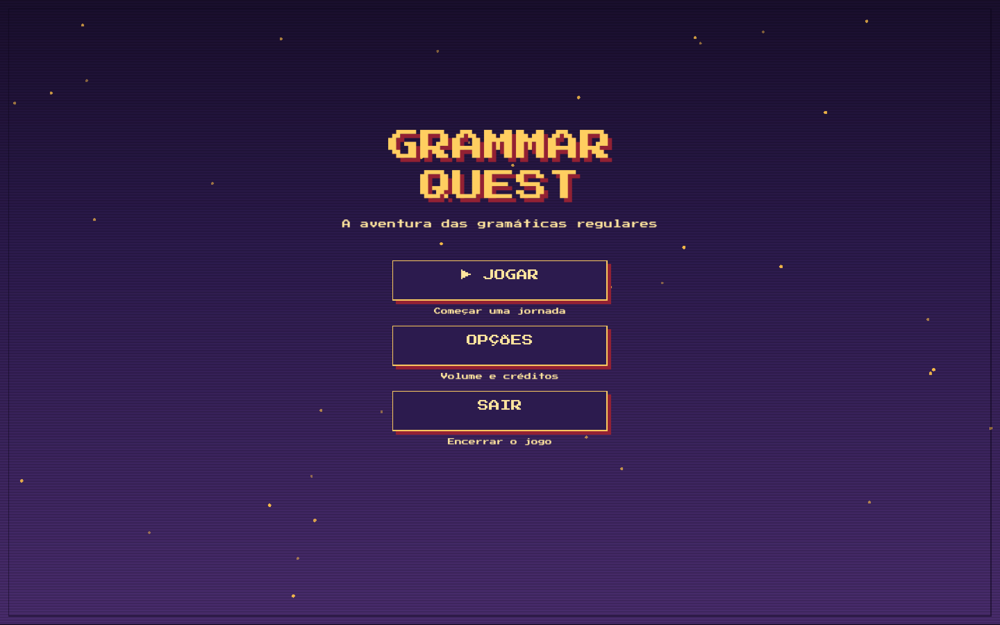

<p align="center">
  
</p>

<h1 align="center">Grammar Quest</h1>

<p align="center">A aventura pixelada das gramáticas regulares.</p>

<p align="center">
  
</p>

Grammar Quest é o Trabalho de Desenvolvimento da disciplina Linguagens Formais
e Autômatos da UNESC. O programa transforma a derivação de gramáticas regulares
em um labirinto 2D: cada porta aplica uma produção real e a pilha controla a
derivação.

O enunciado original está em
[`context/td01-linguagens-formais.pdf`](context/td01-linguagens-formais.pdf).

## Entrega acadêmica

- Entrada de uma gramática `G = {N, T, P, S}`.
- Geração de sentenças aleatórias.
- Derivação por pilha, com o símbolo mais à esquerda no topo.
- Validação de gramáticas regulares.
- Interface gráfica com entrada, pilha, passos e resultado.
- Três exemplos selecionáveis no aplicativo.
- Conversão para expressão regular após a derivação.

## Executar

Requer Rust estável com suporte à edition 2024.

```bash
cargo run -p grammar_quest
```

No laboratório, escolha um exemplo ou escreva produções como:

```text
S -> aS | ab
```

`::=` também é aceito. Símbolos maiúsculos são não-terminais; minúsculos e
dígitos são terminais; `ε`, `&` ou uma alternativa vazia representam a palavra
vazia.

Controles do labirinto:

- `WASD` ou setas: mover;
- `Tab`: mostrar ou ocultar a trilha formal;
- `Esc`: voltar ao laboratório ou ao menu inicial.

## Verificar

```bash
cargo fmt --check
cargo clippy --workspace --all-targets -- -D warnings
cargo test --workspace
cargo build --workspace
```

## Distribuição macOS

```bash
scripts/build-macos-app.sh
scripts/build-macos-dmg.sh
```

Os scripts produzem `dist/Grammar Quest.app` e um DMG com atalho para
`Applications`. O bundle recebe assinatura ad-hoc para preservar sua
integridade; sem um certificado Apple Developer ID, o Gatekeeper mostra um
aviso na primeira abertura.

## Documentação técnica

Veja [`docs/technical.md`](docs/technical.md) para a arquitetura e a estrutura
dos pacotes. As licenças dos recursos estão em
[`crates/grammar_quest/assets/ATTRIBUTION.md`](crates/grammar_quest/assets/ATTRIBUTION.md).
